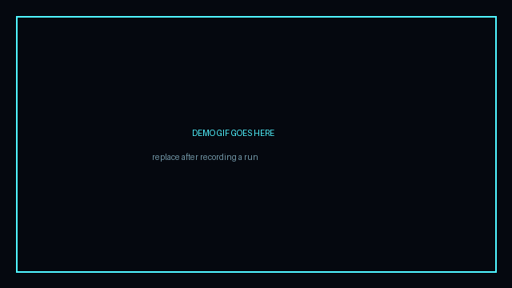

# JARVIS — AI Desktop Assistant with Gesture-Controlled 3D HUD


A local-first, voice-and-gesture-driven assistant. Say "Hey Jarvis", talk to it like a person, and steer a holographic 3D HUD with your bare hands over a webcam.


*(replace `docs/demo-placeholder.gif` with a real screen capture once you've got it running)*

---

## What it does

- **Wake word** — "Hey Jarvis" activates listening, hands-free, fully offline.
- **Speech in, speech out** — local Whisper for transcription, your choice of offline or cloud TTS for replies.
- **An LLM brain** — Claude (or OpenAI) does the reasoning, and can call real functions: open apps, search the web, set timers, adjust volume/brightness, take notes.
- **Skills are plugins** — drop a new Python file in `backend/skills/` and the assistant picks it up.
- **Gesture control** — MediaPipe reads your hand off the webcam; pinch to zoom, rotate your wrist to spin the model, two hands to tilt, a fist to grab, a swipe to dismiss.
- **A HUD that looks the part** — Three.js arc-reactor core, glass panels, a live waveform, cyan-on-black sci-fi aesthetic, driven in real time over WebSocket.

## Architecture

```
┌─────────────────────────────┐         WebSocket (JSON)        ┌───────────────────────────┐
│         BACKEND (Python)     │ ───────────────────────────────▶│      FRONTEND (React)      │
│                               │◀─────────────────────────────── │                            │
│  ┌─────────────┐              │        gesture deltas,          │  ┌──────────────────────┐  │
│  │ wake_word.py │              │        transcript, status,      │  │  ArcReactor.jsx       │  │
│  │  (openWakeWord)             │        TTS "speaking" events    │  │  (Three.js / R3F core)│  │
│  └──────┬───────┘              │                                  │  └──────────────────────┘  │
│         ▼                     │                                  │  ┌──────────────────────┐  │
│  ┌─────────────┐   ┌────────┐ │                                  │  │  HUDPanels.jsx         │  │
│  │   stt.py     │──▶│llm_brain│──skills/ (weather, system,        │  │  Waveform.jsx          │  │
│  │  (Whisper)   │   │  .py   │  web_search, notes, ...) plugins   │  │  Transcript.jsx        │  │
│  └─────────────┘   └───┬────┘ │                                  │  └──────────────────────┘  │
│                        ▼      │                                  │                            │
│                  ┌─────────┐  │                                  │                            │
│                  │  tts.py  │  │                                 │                            │
│                  └─────────┘  │                                  │                            │
│  ┌────────────────────────┐   │                                  │                            │
│  │ gesture_tracker.py       │   │                                 │                            │
│  │ (OpenCV + MediaPipe Hands)│──▶ websocket_server.py ────────────▶│                            │
│  └────────────────────────┘   │                                  │                            │
└─────────────────────────────┘                                   └───────────────────────────┘
```

`backend/main.py` is the orchestrator: it starts the wake-word listener, the gesture tracker, and the WebSocket server as concurrent asyncio tasks, and wires the LLM brain's function calls into the skill plugins.

## Requirements

- Python 3.10+
- Node 18+ (for the frontend)
- A working microphone and webcam (both are optional — see **Fallback behavior** below)
- An Anthropic or OpenAI API key
- ~2 GB free disk for the local Whisper + wake-word models

## Setup

### 1. Clone and configure

```bash
git clone <your-fork-url> jarvis-assistant
cd jarvis-assistant
cp .env.example .env
# edit .env and add your ANTHROPIC_API_KEY (and optionally OPENAI_API_KEY, ELEVENLABS_API_KEY, WEATHER_API_KEY)
```

### 2. Backend (Python)

```bash
cd backend
python -m venv venv

# macOS / Linux
source venv/bin/activate
# Windows (PowerShell)
venv\Scripts\Activate.ps1

pip install -r ../requirements.txt
python main.py
```

On first run, `openWakeWord` and `faster-whisper` will download their model weights (a few hundred MB) — this needs internet access once, after which everything runs offline.

**Platform notes**
- **macOS**: grant Terminal (or your IDE) Microphone and Camera permissions in System Settings → Privacy & Security. `pyaudio` needs `portaudio`: `brew install portaudio` first.
- **Windows**: install the [Visual C++ Build Tools](https://visualstudio.microsoft.com/visual-cpp-build-tools/) if `pyaudio` fails to build, or use `pip install pipwin && pipwin install pyaudio`.
- **Linux**: `sudo apt install portaudio19-dev python3-pyaudio libsm6 libxext6` for audio + OpenCV.

### 3. Frontend (React + Three.js)

```bash
cd frontend
npm install
npm run dev
```

Open `http://localhost:5173`. It connects to the backend's WebSocket server at `ws://localhost:8765` by default (configurable in `frontend/.env`).

### 4. Say the wake word

With both halves running, say **"Hey Jarvis"**, wait for the arc reactor to pulse, then talk. Raise a hand in front of the webcam to drive the HUD directly.

## Configuration

All secrets and tunables live in `.env` (gitignored — copy `.env.example` and fill it in):

| Variable | Purpose | Required |
|---|---|---|
| `ANTHROPIC_API_KEY` | LLM brain (Claude) | Yes, unless using OpenAI |
| `OPENAI_API_KEY` | Alternate LLM brain | No |
| `LLM_PROVIDER` | `anthropic` or `openai` | No (default `anthropic`) |
| `TTS_ENGINE` | `pyttsx3` (offline), `edge-tts`, or `elevenlabs` | No (default `pyttsx3`) |
| `ELEVENLABS_API_KEY` | Needed only if `TTS_ENGINE=elevenlabs` | No |
| `STT_ENGINE` | `whisper-local` or `google` | No (default `whisper-local`) |
| `WEATHER_API_KEY` | Weather skill (OpenWeatherMap) | No |
| `WS_HOST` / `WS_PORT` | WebSocket server bind address | No |
| `WAKE_WORD_SENSITIVITY` | 0.0–1.0, higher = more triggers | No |

## Graceful fallback

The assistant is designed to degrade, not crash, when hardware or network isn't available:

- **No microphone detected** → wake word and STT are disabled; the frontend shows a "voice offline" badge and exposes a text input box for typed commands instead.
- **No webcam detected** → gesture tracking is disabled; the HUD falls back to mouse-drag `OrbitControls` for the 3D core.
- **No network / LLM unreachable** → the assistant responds with a canned "I can't reach my reasoning engine right now" message and still services local skills (timers, system volume) that don't need the LLM.
- Each subsystem (`wake_word.py`, `stt.py`, `gesture_tracker.py`) does its own hardware probe on start and logs a warning rather than raising, so one missing device never takes the rest of the app down.

## Real-time performance

- Gesture landmarks are captured and published over the local WebSocket at the webcam's native frame rate (targeting 30 fps / ~33ms per frame); MediaPipe's lightweight hand model keeps CPU-side inference under ~15ms per frame on a recent laptop CPU, leaving headroom under the ~50ms end-to-end budget between camera frame and HUD update.
- The WebSocket server sends deltas (not full state) for gesture updates to keep payloads small.
- STT/LLM/TTS run in separate asyncio tasks from the gesture loop so a slow LLM response never stalls hand tracking.

## Project structure

```
jarvis-assistant/
├── backend/
│   ├── main.py                # orchestrator / entrypoint
│   ├── config.py              # env loading + settings
│   ├── wake_word.py           # "Hey Jarvis" detection
│   ├── stt.py                 # speech-to-text
│   ├── tts.py                 # text-to-speech
│   ├── llm_brain.py           # Claude/OpenAI reasoning + function calling
│   ├── gesture_tracker.py     # MediaPipe Hands + gesture classification
│   ├── websocket_server.py    # broadcasts gesture/voice events to the HUD
│   └── skills/
│       ├── base_skill.py      # plugin interface every skill implements
│       ├── weather_skill.py
│       ├── system_control_skill.py
│       ├── web_search_skill.py
│       └── notes_skill.py
├── frontend/
│   └── src/
│       ├── App.jsx
│       ├── hooks/useWebSocket.js
│       └── components/
│           ├── ArcReactor.jsx   # 3D core + gesture-driven camera/object transforms
│           ├── HUDPanels.jsx    # glass side panels, status readouts
│           ├── Waveform.jsx     # live voice-activity waveform
│           └── Transcript.jsx   # scrolling conversation transcript
├── docs/ARCHITECTURE.md
├── requirements.txt
├── .env.example
└── LICENSE
```

## Writing a new skill

Every skill is a small class in `backend/skills/`:

```python
from .base_skill import BaseSkill

class TimerSkill(BaseSkill):
    name = "set_timer"
    description = "Set a countdown timer for N minutes."
    parameters = {"minutes": {"type": "number", "description": "Duration in minutes"}}

    async def run(self, minutes: float) -> str:
        # ... start a timer, return a confirmation string
        return f"Timer set for {minutes} minutes."
```

`llm_brain.py` auto-discovers everything in `backend/skills/` at startup and exposes each as a tool the LLM can call — no registration step needed.

## Roadmap / known gaps

- [ ] Swap the placeholder gesture→camera mapping constants for a calibration step (hand size varies by user/distance).
- [ ] Add a proper VAD (voice activity detector) instead of push-to-talk-style silence timeout in `stt.py`.
- [ ] Persist notes/skill state to disk instead of in-memory.
- [ ] Package as a single cross-platform installer.

## License

MIT — see [LICENSE](LICENSE).
